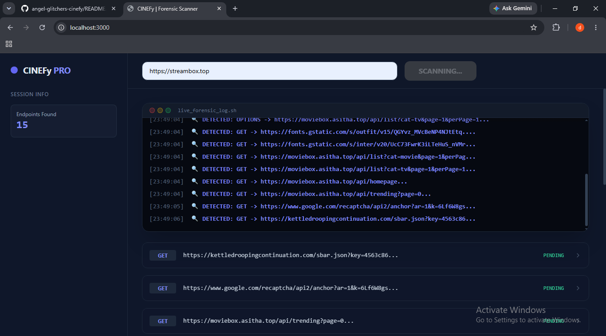

<div align="center">
  
</div>

<br>

<div align="center">
  
  <h1>⌁ API FINDER AND SOURCE CODE EXTRCTOR ⌁</h1>
  
</div>

<br>

<p align="center">
  
  
  
  
  
</p>

---

### ◈ WHAT IS CINEFY PRO?

**CINEFy Pro** is a lightweight, blazing-fast JavaScript intelligence engine designed to reveal what the browser hides. It automatically discovers hidden API endpoints, maps complex network patterns, intelligently scrolls through lazy-loaded content, and extracts entire websites in seconds. 

> 🔍 *"Don't guess APIs — reveal them."*

No encryption. No obfuscation. No magic. Just clean, transparent, and highly optimized code built for developers who demand deep system visibility.

---

### ⚡ CORE CAPABILITIES

| 🛠 Feature | 📖 Description |
| :--- | :--- |
| 🔍 **API Discovery** | Automatically finds hidden, undocumented, and dynamic endpoints. |
| 🧠 **Smart Crawling** | Follows network patterns & DOM changes like a human — but exponentially faster. |
| 📜 **Lazy-Load Scanner** | Intelligently triggers & captures dynamically loaded content on scroll. |
| 📡 **Network Mapping** | Visualizes & logs every single request, header, and payload. |
| 💾 **Full HTML Extraction** | Pulls the complete rendered DOM of any target in seconds. |
| 📊 **Auto Reports** | Generates clean, structured, and downloadable analysis reports. |
| 👻 **Stealth Mode** | Operates silently without triggering standard browser anti-bot detectors. |
| 🚀 **Async Architecture** | Non-blocking, high-concurrency processing for maximum speed & stability. |

<br>

> [!IMPORTANT]
> 💚 **GIVEN FREE WITH LOVE:** CINEFy PRO is completely given **FREE** for the eveloper community by us. we are from SRI LANKA. and i am still a beginner so it may have problems.
> SINHALA:: Api "jaale neweyi" 

---

---

<div align="center">

### 💡 Open & Unlocked

> [!IMPORTANT]
> **💚Zero Encryption • Zero Encoding💚**
>
> This source code is intentionally kept in plain text. No hidden layers, no complex obfustication. Built from the ground up to be completely transparent, readable, and easy to study.

*Built with ❤️ for the next generation of developers, by a beginner who gets it.*

### 🛠️ Developed by **Angel GLITCHERS**

</div>

---

### 📦 GET STARTED

CINEFy Pro is optimized for **local execution**. No cloud dependencies, no telemetry. Run it directly on your machine:

```bash
# 1. Clone the repository
git clone https://github.com/defenderkingdom46-ctrl/angel-glitchers-cinefy.git

# 2. Navigate into the directory
cd project-cinefy-angels

# 3. Install dependencies
npm install

# 4. Launch the intelligence engine
node index.js
```

*CONTACT ME*
```bash
binduwayi haththa pahayi pol gediyayi wade dekayi
```

*SINHALEN AHAGANIN*
```bash
API JAALE NEWYI AAYI KIWWA
```

```bash
GATHTHANM CREDIT EHEMA APITATH DIPAN
